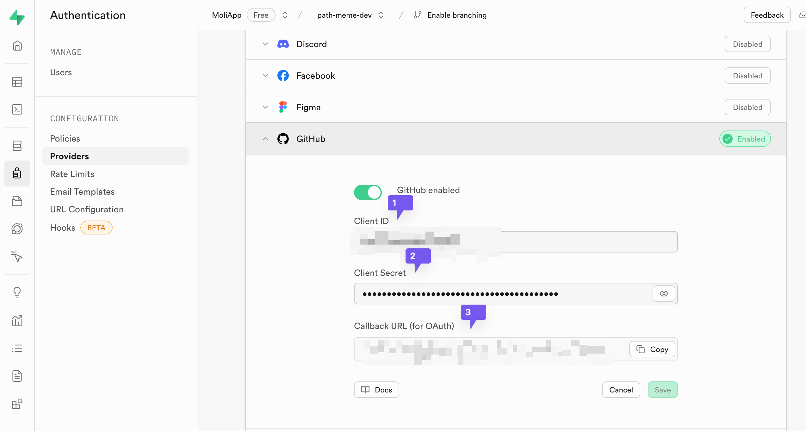
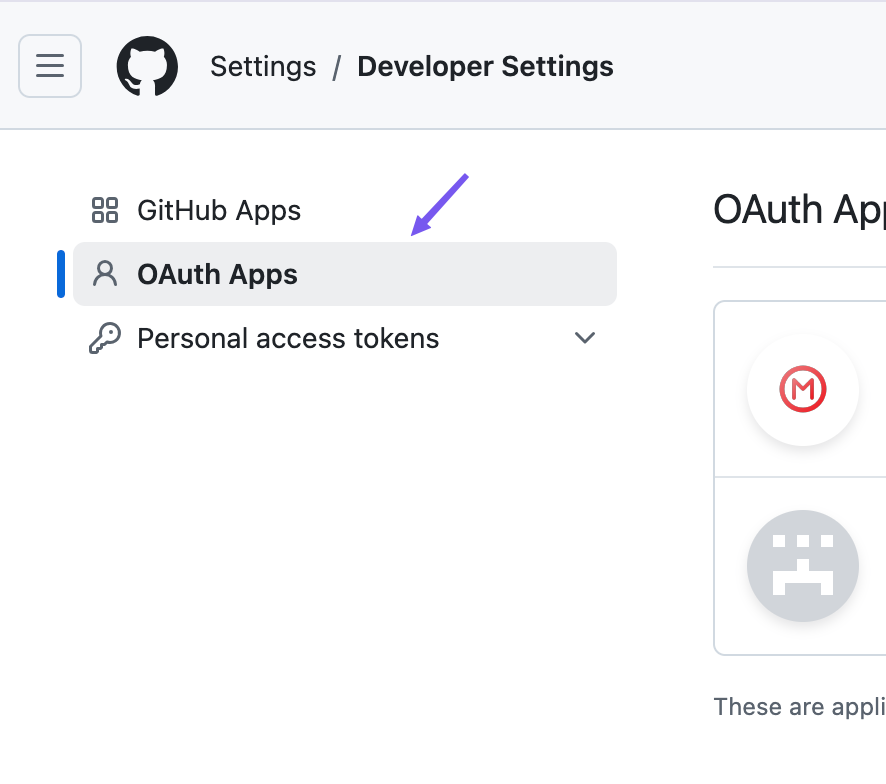

# Path Meme

[English](./readme.md) | 简体中文


## 简介

Path Meme 是一个简洁、现代的博客系统，灵感来源于 Path 应用的用户界面。它使用 GitHub Issues 作为内容管理系统，使用 Cloudflare Pages 进行静态网站托管。这个系统提供了一个时间线式的博客展示，支持 Markdown 渲染、标签分类、反应统计等功能。

**项目链接：**
- 代码仓库：[https://github.com/gusibi/path-momo-web](https://github.com/gusibi/path-momo-web)
- 在线演示：[https://momo.gusibi.mobi](https://momo.gusibi.mobi)


## 特性

- ✨ 使用 GitHub Issues 作为 CMS
- 💬 同步 GitHub Issues 评论作为博客评论
- 🔐 支持使用 Github 账号登录
- 🗄️ 集成 Supabase
- ⏱️ 时间线式的博客展示
- 📝 Markdown 内容渲染
- 🏷️ 标签分类系统
- 👍 GitHub 反应（Reactions）统计
- 🌙 夜间模式
- 📱 响应式设计

## 使用指南

### 前提条件

- GitHub 账号
- Cloudflare 账号
- Supabase 账号
- 基本的命令行操作知识

### 部署步骤

1. **Fork 项目**
   - 登录 GitHub 账号
   - 点击右上角的 "Fork" 按钮

2. **配置 Cloudflare Pages**
   - 登录 Cloudflare 账号
   - 进入 "Workers & Pages"
   - 选择 "Create application" -> "Pages"
   - 连接 GitHub 并选择已 Fork 的项目
   - 配置部署命令和目录
   
   

3. **配置 Supabase**
   - 创建 Supabase 项目
   - 启用 GitHub 登录
   - 配置 OAuth 回调 URL
   
   
   

4. **配置 GitHub OAuth**
   - 访问 GitHub 开发者设置：https://github.com/settings/developers
   - 创建新的 OAuth App
   - 设置回调 URL 和主页 URL
   
   

5. **配置环境变量**
   - 在 Cloudflare Pages 设置中添加环境变量：
     - `SUPABASE_URL`
     - `SUPABASE_KEY`
   
   

### 本地开发

```bash
git clone https://github.com/gusibi/path-meme-web.git
cd path-meme-web
npm install
npm run dev
```

## 配置参数

| 参数 | 说明 | 配置方式 | 配置位置 |
|------|------|----------|----------|
| 站点地址 | 你的站点 URL 或自定义域名 | 环境变量或配置文件 | `SITE_URL` 或 `nuxt.config.ts` |
| 站点名称 | 导航栏显示的网站名称 | 配置文件 | `nuxt.config.ts` 中的 `siteTitle` |
| 站点描述 | 网站的描述信息 | 配置文件 | `nuxt.config.ts` 中的 `siteDescription` |
| 仓库用户名 | GitHub 用户名 | 环境变量或配置文件 | `REPO_OWNER` 或 `nuxt.config.ts` |
| 仓库名称 | GitHub 仓库名 | 环境变量或配置文件 | `REPO_NAME` 或 `nuxt.config.ts` |

## 故障排除

- **博客文章未显示**
  - 检查 Cloudflare Worker 的日志
  - 确认 API 请求是否成功

- **样式未正确加载**
  - 检查 Cloudflare Pages 的部署日志
  - 确认静态资源是否正确上传

- **登录问题**
  - 验证 GitHub OAuth 配置是否正确
  - 检查 Supabase 设置是否完整

## 贡献指南

欢迎提交 Pull Requests 来改进项目。对于重大更改，请先创建 Issue 讨论你想要改变的内容。

## 许可证

本项目采用 MIT 许可证。详情请参阅 [LICENSE](LICENSE) 文件。