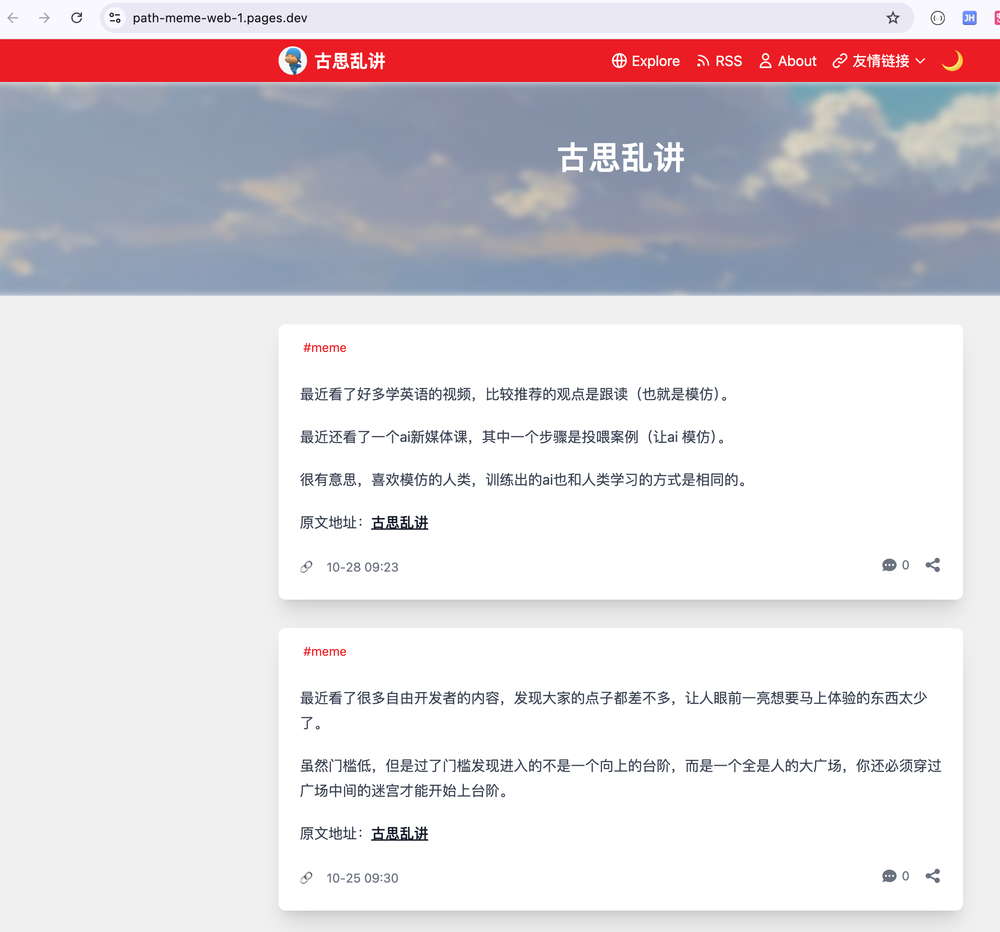
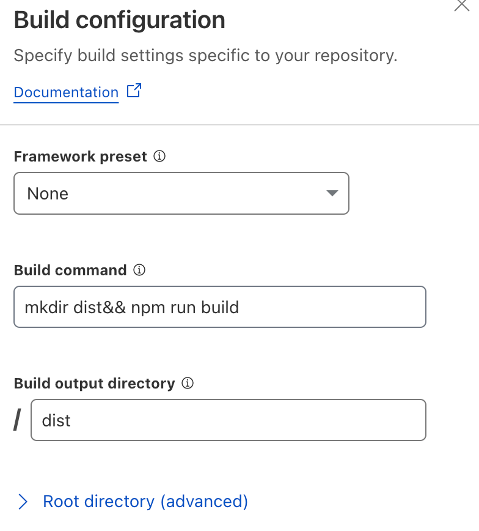
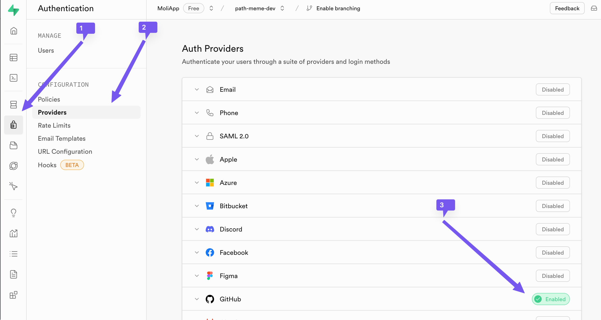
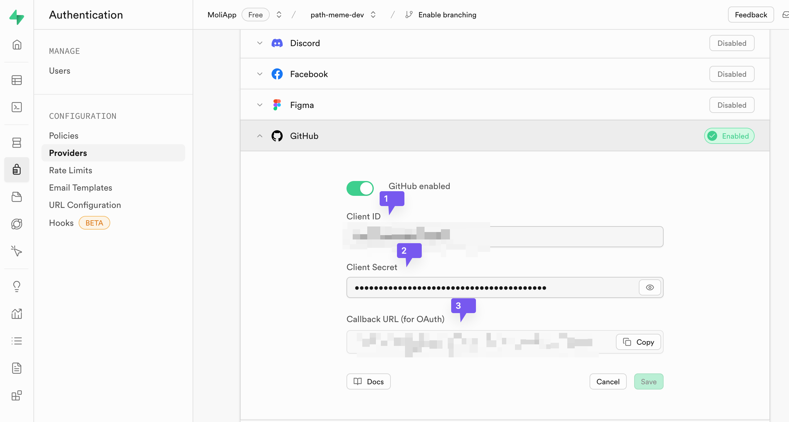
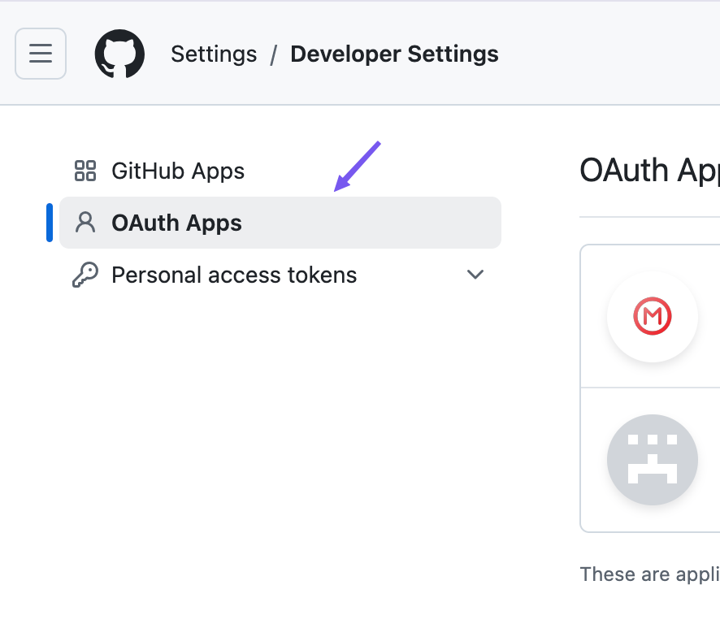
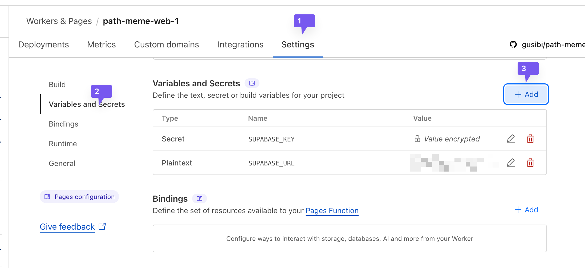

# Path Meme

[简体中文](./readme-zh.md) | English

## Introduction

Path Meme is a clean, modern blogging system inspired by the Path app's user interface. It uses GitHub Issues as a content management system, provides API services through Cloudflare Workers, and uses Cloudflare Pages for static website hosting. The system offers a timeline-style blog display with features including Markdown rendering, tag categorization, and reaction statistics.

**Project Links:**
- Repository: [https://github.com/gusibi/path-momo-web](https://github.com/gusibi/path-momo-web)
- Demo: [https://momo.gusibi.mobi](https://momo.gusibi.mobi)



## Features

- ✨ GitHub Issues as CMS
- 💬 GitHub Issues comments synchronization
- 🔐 GitHub account authentication
- 🗄️ Supabase integration
- ⏱️ Timeline-style blog display
- 📝 Markdown content rendering
- 🏷️ Tag categorization system
- 👍 GitHub reactions statistics
- 🌙 Dark mode
- 📱 Responsive design

## Getting Started

### Prerequisites

- GitHub account
- Cloudflare account
- Supabase account
- Basic command line knowledge

### Deployment Steps

1. **Fork the Project**
   - Log into your GitHub account
   - Click the "Fork" button in the top right corner

2. **Configure Cloudflare Pages**
   - Log into your Cloudflare account
   - Navigate to "Workers & Pages"
   - Select "Create application" -> "Pages"
   - Connect GitHub and select your forked project
   - Configure deployment commands and directory
   
   

3. **Set up Supabase**
   - Create a Supabase project
   - Enable GitHub authentication
   - Configure OAuth callback URL
   
   
   

4. **Configure GitHub OAuth**
   - Go to GitHub developer settings: https://github.com/settings/developers
   - Create a new OAuth App
   - Set callback URL and homepage URL
   
   

5. **Set Environment Variables**
   - Add environment variables in Cloudflare Pages settings:
     - `SUPABASE_URL`
     - `SUPABASE_KEY`
   
   

### Local Development

```bash
git clone https://github.com/gusibi/path-meme-web.git
cd path-meme-web
npm install
npm run dev
```

## Configuration Parameters

| Parameter | Description | Configuration Method | Location |
|-----------|-------------|---------------------|----------|
| Site URL | Your site URL or custom domain | Environment variable or config file | `SITE_URL` or `nuxt.config.ts` |
| Site Name | Website name shown in navigation bar | Config file | `siteTitle` in `nuxt.config.ts` |
| Site Description | Website description | Config file | `siteDescription` in `nuxt.config.ts` |
| Repository Owner | GitHub username | Environment variable or config file | `REPO_OWNER` or `nuxt.config.ts` |
| Repository Name | GitHub repository name | Environment variable or config file | `REPO_NAME` or `nuxt.config.ts` |

## Troubleshooting

- **Blog Posts Not Displaying**
  - Check Cloudflare Worker logs
  - Verify API request success

- **Styles Not Loading**
  - Review Cloudflare Pages deployment logs
  - Confirm static assets are properly uploaded

- **Login Issues**
  - Verify GitHub OAuth configuration
  - Check Supabase settings completeness

## Contributing

Pull requests are welcome to improve the project. For major changes, please open an issue first to discuss what you would like to change.

## License

This project is licensed under the MIT License. See the [LICENSE](LICENSE) file for details.