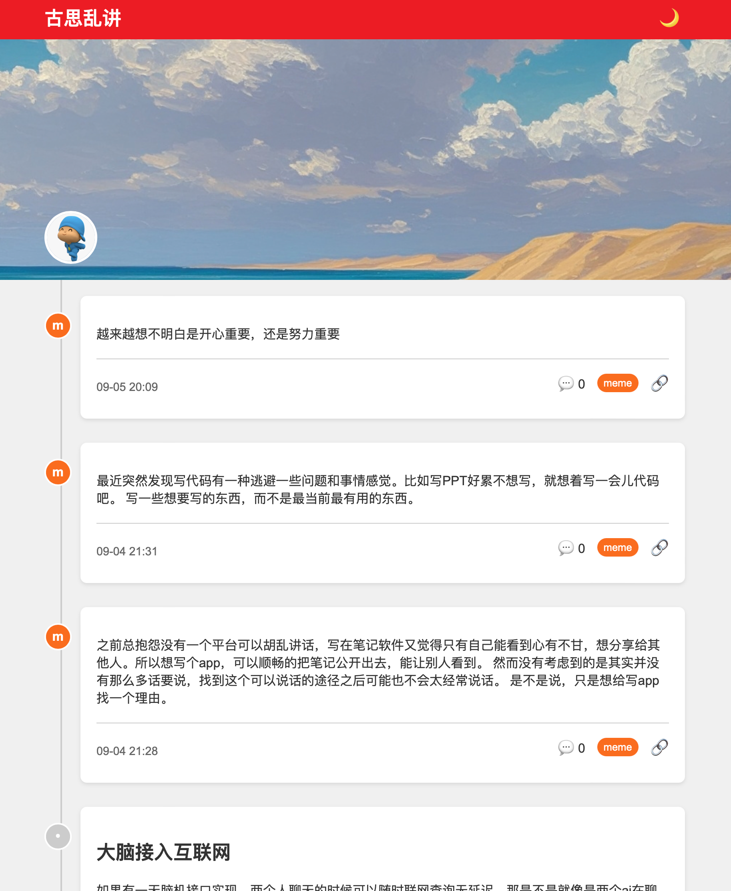

# Path Meme

## 简介

Path Meme 是一个简洁、现代的博客系统，灵感来源于 Path 应用的用户界面。它使用 GitHub Issues 作为内容管理系统，通过 Cloudflare Workers 提供 API 服务，并使用 Cloudflare Pages 进行静态网站托管。这个系统提供了一个时间线式的博客展示，支持 Markdown 渲染、标签分类、反应统计等功能。

项目地址: [https://github.com/gusibi/path-momo-web](https://github.com/gusibi/path-momo-web)
demo: [https://momo.gusibi.mobi](https://momo.gusibi.mobi)

## 特性

- 使用 GitHub Issues 作为 CMS
- 时间线式的博客展示
- Markdown 内容渲染
- 标签分类系统
- GitHub 反应（Reactions）统计
- 夜间模式
- 响应式设计



## 如何使用

### 前提条件

- GitHub 账号
- Cloudflare 账号
- 基本的命令行操作知识

### 详细步骤

1. **Fork 此项目**

   a. 登录你的 GitHub 账号
   b. 点击右上角的 "fork" 图标


2. **设置 Cloudflare Worker**
    此步骤的目的是创建一个 Cloudflare worker 作为 后端api 使用

   a. 登录 Cloudflare 账号
   b. 进入 "Workers" 页面
   c. 点击 "Create a Worker"，可以起名叫 path-momo-api
   d. 将 `worker/index.js` 中的代码粘贴到编辑器中
   e. 点击 "Save and Deploy"
   f. 此时，你的 worker 已经创建成功，并且会自动生成一个 worker 的 url，记下这个 url，后面会用到，访问这个api 会报错，因为关键的变量还没有配置
   格式类似与 `https://{your-worker-path}.workers.dev/api/blog-posts`

3. **配置 GitHub Personal Access Token**

   a. 在 GitHub 中，进入 Settings > Developer settings > Personal access tokens
   b. 点击 "Generate new token"
   c. 给 token 一个描述性的名称
   d. 选择 "repo" 范围
   e. 点击 "Generate token"
   f. 复制生成的 token

4. **更新 Cloudflare Worker**

   a. 回到刚才创建的 worker，进入设置页面 > 选择变量，添加以下变量
   b. `GITHUB_TOKEN`，值为你刚刚生成的 GitHub Personal Access Token
   c. `GITHUB_OWNER`，值为你 GitHub 用户名
   d. `GITHUB_REPOGIT`，值为你需要使用的 repo
   e. 点击 "部署"
   f. 部署完成后，第二步不能访问的 api 就可以访问了


5. **克隆仓库到本地**

   打开终端，运行以下命令：

   ```bash
   git clone https://github.com/你的用户名/path-style-blog.git
   cd path-style-blog
   ```

6. **更新前端代码中的 API URL**

   在 `public/script.js` 中，将 fetch 请求的 URL 更新为你的 Cloudflare Worker 的 URL。

7. **提交并推送更改**

    ```bash
    git add .
    git commit -m "update api url"
    git push origin main
    ```


8. **设置 Cloudflare Pages**

   a. 在 Cloudflare 中，进入 "Pages" 页面
   b. 点击 "Create a project"
   c. 选择 "Connect to Git"
   d. 选择你的 GitHub 仓库
   e. 在构建设置中，将构建命令留空，将构建输出目录设置为 "public"
   f. 点击 "Save and Deploy"


9. **创建博客文章**

    a. 在你第四步选择的 GitHub 仓库中，进入 "Issues" 标签页
    b. 点击 "New issue"
    c. 使用 Markdown 格式编写你的博客文章
    d. 添加标签（可选）
    e. 点击 "Submit new issue"

10. **访问你的博客**

    打开 Cloudflare Pages 为你的项目提供的 URL，你应该能看到你的博客了。

## 自定义

- **Banner 图片**: 将你的 banner 图片添加到 `public` 文件夹，并在 `index.html` 中更新图片路径。
- **头像**: 同样，将你的头像图片添加到 `public` 文件夹，并在 `index.html` 中更新图片路径。
- **样式**: 你可以通过修改 `styles.css` 来自定义博客的外观。
- **功能**: 如果你想添加新功能，可以修改 `script.js` 和 Cloudflare Worker 中的 `index.js`。

## 故障排除

- 如果博客文章没有显示，检查 Cloudflare Worker 的日志以确保 API 请求成功。
- 确保你的 GitHub Personal Access Token 有正确的权限并且没有过期。
- 如果样式没有应用，检查 Cloudflare Pages 的部署日志，确保所有文件都被正确上传。

## 贡献

欢迎提交 Pull Requests 来改进这个项目。对于重大更改，请先开一个 issue 讨论你想要改变的内容。

## 许可

这个项目使用 MIT 许可证。详情请见 [LICENSE](LICENSE) 文件。